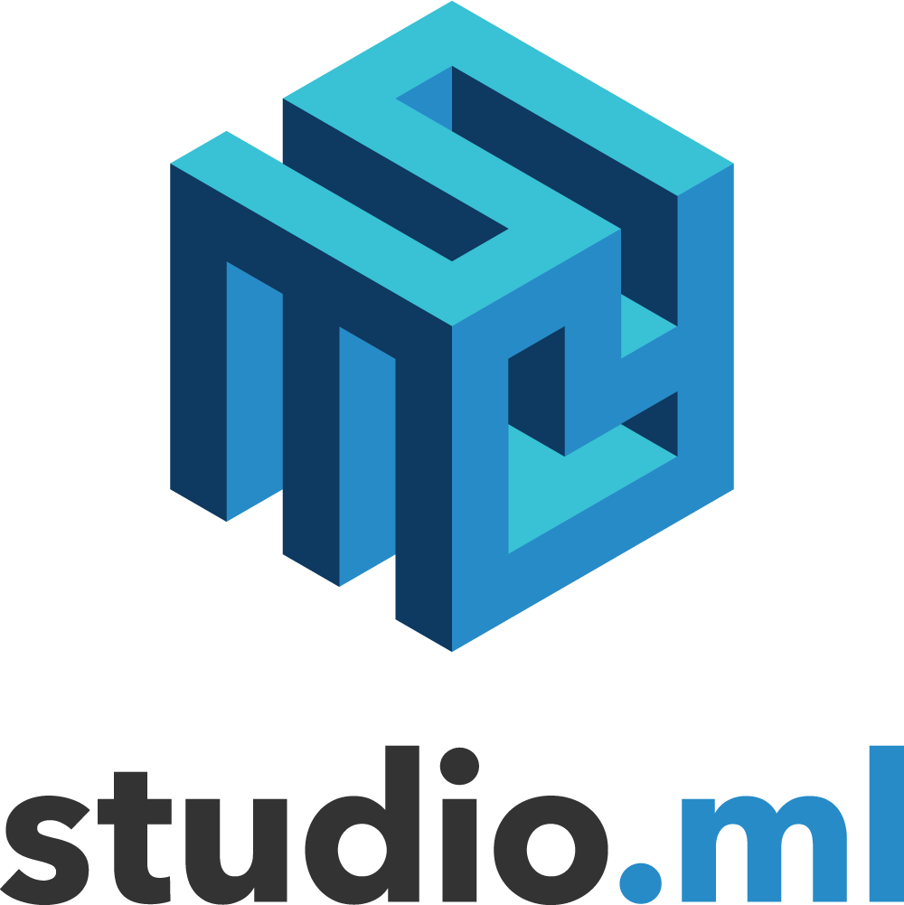

# TensorFlow Studio

  

TensorFlow studio is a model management framework written in Python to help simplify and expedite your model building experience. It was developed to minimize any overhead involved with the scheduling, running, monitoring or mangagement of artifacts of your machine learning experiments in Python without invasion of your code. No one wants to spend their time configuring different machines, setting up dependencies, or playing archeology to track down previous model artifacts. 

Most of the features are compatible with any Python machine learning framework ([Keras](https://github.com/fchollet/keras), [TensorFlow](https://github.com/tensorflow/tensorflow), [scikit-learn](https://github.com/scikit-learn/scikit-learn), etc); some extra features are available for Keras and TensorFlow.

**Use TFstudio to:** 
* Capture experiment information- Python environment, files, dependencies and logs- without modifying the experiment code.
* Monitor and organize experiments using a web dashboard that integrates with TensorBoard.
* Run experiments locally, remotely, or in the cloud (Google Cloud or Amazon EC2)
* Manage artifacts (persistence?)
* Perform hyperparameter search
* Create customizable Python environments for remote workers.
    

## Example usage

Start visualizer:

    studio ui

Run your jobs:

    studio run myfile.py

You can see results of your job at http://127.0.0.1:5000. 
Run `studio {ui|run} --help` for a full list of ui / runner options

## Installation
### Installation Packaging
Once open sourced, we'll publish package to PyPI. For now, pip install it from the git project directory:

    git clone https://github.com/ilblackdragon/studio && cd studio && pip install -e .

A setup.py is included in the top level of the git repository that allows the creation of tar archives for installation on runners and other systems where git is not the primary use case for handling Python artifacts.  To create the installable, use the following command from the top level directory of a cloned repository:

    python setup.py sdist

This command will create a file dist/studio-x.x.tar.gz that can be used with pip as follows:

    pip install studio-x.x.tar.gz

Certain types of runners can make use of the studio software distribution to start projects without any intervention, devops less runners.  To include the software distribution, add the tar.gz file to your workspace directory under a dist subdirectory.  Runners supporting software distribution will unroll the software and install it using virtualenv.

We recommend setting up a [virtual environment](https://github.com/pypa/virtualenv).

### CI/CD pipeline

The TFStudio project distributes official releases using a travis based build and deploy pipeline.  The Travis project that builds the official github repository for TFStudio has associated with it encrypted user and password credentials that the travis yml file refers to, these secrets can be updated using the Travis configuration found at https://travis-ci.com/SentientTechnologies/studio/settings.  The PYPI_PASSWORD and PYPI_USER variables should point at an owner account for the project.  To rotate these values remove the old ones using the settings page and re-add then same variables with new values.

When code is pushed to the master branch in the github repository a traditional build will be performed by travis.  To push a release after the build is complete add a semver compatible version number as a tag to the repository and do a 'git push --tags' to trigger the deployment to pypi.  Non tagged builds are never pushed to pypi.  Any tag will results in a push to pypi so care should be taken to manage the visible versions using the PYPI_USER account.

### Release process

TFStudio is released as a binary or source distribution using a hosted package at pypi.python.org. To release TFStudio you must have administrator role access to the TFStudio Package on the https://pypi.python.org/ web site.  Releases are done using the setup packaging found inside the setup.py files.

When working with the pypi command line tooling you should create a ~/.pyirc file with your account details, for example:

[distutils]
index-servers=
    pypi
    testpypi

[testpypi]
repository = https://testpypi.python.org/pypi
username = {your pipy account}
password = {your password}

[pypi]
username = {your pipy account}

The command to push a release is as follows.

    python setup.py sdist upload

If you wish to test releases and not pollute our pypi production release train and numbering please use the '-r' option to specify the test pypi repository.  pypi releases are idempotent.

### Running tests
To run the unit and regression tests, run 

    python $(which nosetests) --processes=8 --process-timeout=600

Note that simply `nosetests` tends not to use virtualenv correctly. If you have application credentials configured 
to work with distributed queues and cloud workers, those will be tested as well. Otherwise, respective tests will be skipped. The total test runtime, when run in parallel 
as in the command above, should be no more than 10 minutes. Most of the tests are I/O limited, so parallel execution speeds up things quite a bit. The longest test is the
gpu cloud worker test in EC2 cloud (takes about 500 seconds due to installation of the drivers / CUDA on the EC2 instance).

## Authentication 
Both studio ui and studio runner use the same authentication tokens for a database backend. The tokens are valid for one hour, 
but if TFstudio is running, it renews the tokens automatically. 

Note that refresh tokens do not expire; this means you can use these tokens on multiple machines, e.g. when you want to use a Google account authentication on a remote server but don't want to open extra ports. Simply copy the contents of ~/.tfstudio/keys folder to the desired machine.

Currently TensorFlow studio supports 2 methods of authentication: email and password and using a Google account.
To use studio runner and studio ui in guest mode, in studio/default_config.yaml, uncomment "guest: true" under the database section.

Alternatively, you can set up your own database and configure TFstudio to use it. See [setting up database](docs/setup_database.md). This is a preferred option if you want to keep your models and artifacts private. 

### Email / password authentication
If you have an email and password account set up, you can use this method. In default_config.yaml, uncomment "use_email_auth: true" 
under the database section. If the token is not found or expired when you run studio ui / studio runner, you will be asked fof your email and password for authentication. Note that the password is NOT stored on your computer (but tokens are), 
so you will be asked for your password after an hour of inactivity. 

### Google account authentication
If you don't have an email and password account set up, don't despair! Any user with a Google account can use TensorFlow studio as a 
first-class citizen. If a token is not found when you run studio, the Web UI will redirect you to the Google account authentication app where you will be issued a new authentication token.

## Further reading and cool features
* [Running experiments remotely](docs/remote_worker.md)
   * [Custom Python environments for remote workers](docs/customenv.md)
* [Running experiments in the cloud](docs/cloud.md)
   * [Google Cloud setup instructions](docs/gcloud_setup.md)
   * [Amazon EC2 setup instructions](docs/ec2_setup.md)
* [Artifacts management](docs/artifacts.md)
* [Hyperparameter search](docs/hyperparams.md)
* [Pipelines for trained models](docs/model_pipelines.md)

